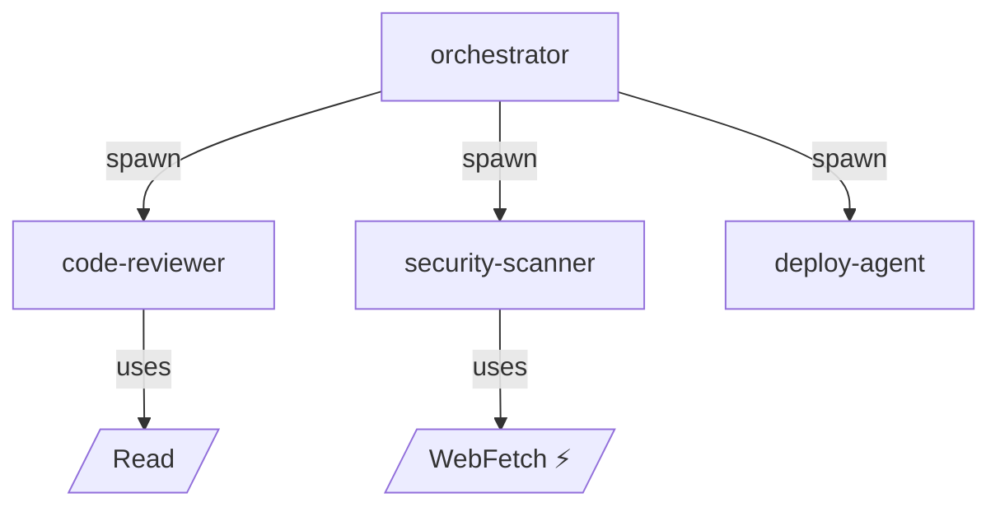

# Agent AIBOM

**Agentic AI Bill of Materials** — Discover, graph, score, and export inventories of AI agents across frameworks.

ML-BOM tells you what model components exist. **Agentic AI BOM tells you which autonomous system could act, through which tools, under which authority, with what traceability.**

---

## What It Does

Agent AIBOM scans your codebase, finds every AI agent (Claude Code, MCP servers, CrewAI, LangGraph, AutoGen, or generic LLM usage), maps their tools and permissions into a graph, scores risk, and exports the result in standard formats.

```
┌─────────────────────────────────────────────────┐
│  Scan repo → Discover agents → Build graph      │
│  → Score risk → Export BOM → Persist & Diff     │
└─────────────────────────────────────────────────┘
```

**Real-world validation:** Scanned a production multi-agent platform → **132 agents discovered, 1,046 tools mapped, 384 risk findings, Grade B (3.95/10)** in under 30 seconds.

---

## Quick Start

```bash
# Clone and install
git clone https://github.com/agent-aibom/agent-aibom.git
cd agent-aibom
python3 -m venv .venv
source .venv/bin/activate
pip install pydantic typer rich networkx pyyaml python-frontmatter

# Scan a repo
PYTHONPATH=. python -m agent_aibom.cli scan /path/to/your/repo

# Run risk assessment
PYTHONPATH=. python -m agent_aibom.cli risk /path/to/your/repo

# Export in multiple formats
PYTHONPATH=. python -m agent_aibom.cli export /path/to/your/repo -f json,sarif,csv

# Generate Mermaid graph
PYTHONPATH=. python -m agent_aibom.cli graph /path/to/your/repo --type permissions --output mermaid

# Compare two scans
PYTHONPATH=. python -m agent_aibom.cli diff <serial-1> <serial-2>
```

---

## CLI Commands

| Command | Description |
|---|---|
| `agent-aibom scan <path>` | Discover agents and generate a BOM |
| `agent-aibom risk <path>` | Run risk assessment with severity grading |
| `agent-aibom export <path> -f json,sarif,csv` | Export BOM in one or more formats |
| `agent-aibom graph <path> -t permissions -o mermaid` | Generate permission or delegation graph |
| `agent-aibom diff <bom-a> <bom-b>` | Compare two BOMs (accepts serial numbers or file paths) |
| `agent-aibom version` | Show version |

### Global Flags

| Flag | Env Var | Description |
|---|---|---|
| `--store-dir PATH` | `AGENT_AIBOM_STORE_DIR` | Override BOM storage location (default: `~/.agent-aibom/boms/`) |
| `--config PATH` | — | Path to `agent-aibom.yaml` config file |
| `--quiet` | — | Minimal output (scan only) |

---

## What It Discovers

### Frameworks

| Framework | Scanner | What it parses |
|---|---|---|
| **Claude Code** | `claude_scanner.py` | `.claude/agents/*.md` (frontmatter + body), `.claude/skills/*/SKILL.md`, delegation patterns (`subagent_type`, `TeamCreate`, `SendMessage`) |
| **MCP** | `mcp_scanner.py` | `.mcp.json` server definitions, `@mcp.tool()` decorated functions in `server.py` |
| **CrewAI** | `crewai_scanner.py` | `agents.yaml`, `crewai.yaml`, Python `Agent()` instantiations |
| **LangGraph** | `langgraph_scanner.py` | `StateGraph` definitions, `add_node`/`add_edge` calls, `@tool` decorators |
| **AutoGen** | `autogen_scanner.py` | `AssistantAgent`, `UserProxyAgent`, `GroupChat` instantiations |
| **Generic** | `generic_scanner.py` | Heuristic: `openai.ChatCompletion`, `anthropic.Anthropic`, LangChain patterns |

### Per-Agent Data Captured

- **Identity:** Name, description, framework, source file, owner, version
- **Tools:** Name, type (MCP/API/CLI/filesystem/browser), external flag, parameters
- **Permissions:** Resource, scopes (read/write/execute/admin/network/full), conditions
- **Models:** Provider, model ID, version, approval status
- **Delegations:** From/to agent, type (spawn/route/escalate/collaborate), depth limit
- **Memory stores:** Type, location, PII flag, retention
- **Approval gates:** Type (human-in-loop, policy-check, budget-limit), approvers

---

## Risk Engine

### 12 Built-in Rules

| Rule | Severity | Trigger |
|---|---|---|
| `excessive-permissions` | HIGH | Agent has ADMIN or FULL scope |
| `missing-approval-gate` | HIGH | External tools but no approval gate |
| `unapproved-model` | MEDIUM | Model not in approved list |
| `unapproved-tool` | MEDIUM | Tool not in approved list |
| `no-owner` | MEDIUM | Agent has no owner assigned |
| `external-action` | HIGH | Agent can call external APIs/services |
| `data-exfiltration` | CRITICAL | Agent has both network + read permissions |
| `prompt-injection` | HIGH | Web input + code execution tools combined |
| `unbounded-delegation` | HIGH | Delegation without depth limit |
| `missing-trace` | LOW | No runtime tracing configured |
| `stale-dependency` | LOW | Dependency has known CVEs |
| `secret-exposure` | CRITICAL | Secrets found in agent config/prompts |

### Scoring

```
Score = Σ(severity_weight × count) / max_possible × 10
Weights: critical=10, high=7, medium=4, low=1, info=0
Grades: A (0-2) | B (2-4) | C (4-6) | D (6-8) | F (8-10)
```

### Provenance

Every finding includes:
- `source`: `static-analysis` | `heuristic` | `runtime` | `policy` | `manual`
- `confidence`: 0.0 – 1.0
- `source_file`: exact file that triggered the finding
- `source_line`: line number (when available)

---

## Export Formats

| Format | File | Target Audience | Notes |
|---|---|---|---|
| **JSON** | `agent-aibom.json` | Developers, APIs | Native Pydantic serialization, full BOM |
| **SARIF** | `agent-aibom.sarif` | Security teams, GitHub Security tab | Risk findings → SARIF 2.1.0 results |
| **CSV** | `agent-aibom.csv` | Auditors, spreadsheet users | One row per agent, flat table |

### SARIF Integration

SARIF output is compatible with GitHub Code Scanning, VS Code SARIF Viewer, and any SARIF 2.1.0 consumer. When you run `export --format sarif`, risk scoring runs automatically if findings aren't already populated.

---

## Graphs & Visualization

### Permission Graph

Maps **Agent → Tool → System** relationships. Answers:
- "Which agents can take external actions?"
- "Who has access to the filesystem + network?" (data exfiltration surface)
- "What's the full permission matrix?"

### Delegation Graph

Maps **Agent → Agent** hierarchies. Answers:
- "What's the blast radius if this agent is compromised?"
- "Who delegates to whom? At what depth?"
- "Which agents are roots? Which are leaves?"

### Output Formats

| Format | Flag | Use case |
|---|---|---|
| **Mermaid** | `--output mermaid` | Embed in GitHub READMEs, PRs, docs |
| **DOT** | `--output dot` | Render with Graphviz, large graphs |
| **D3 JSON** | `--output d3` | Feed into D3.js visualizations |

Example Mermaid output:


---

## BOM Persistence & Diff

Every `scan`, `risk`, and `export` command persists the BOM to a local registry (JSON files).

```bash
# Default location
~/.agent-aibom/boms/

# Override for CI
export AGENT_AIBOM_STORE_DIR=$CI_PROJECT_DIR/.aibom-store
agent-aibom scan .

# Or via flag
agent-aibom scan . --store-dir ./my-store
```

### Diffing BOMs

```bash
# By serial number (from scan --quiet output)
agent-aibom diff urn:uuid:abc-123 urn:uuid:def-456

# By file path
agent-aibom diff ./baseline.json ./current.json
```

Output:
```
╭──── BOM Diff ────╮
│ +3 added  -1 removed  ~2 changed │
╰──────────────────╯

Added agents:
  + new-monitoring-agent
  + new-deploy-agent
  + new-review-agent

Removed agents:
  - deprecated-scanner

Changed agents:
  ~ orchestrator: tools: 12→15
  ~ security-scanner: delegs: 1→3
```

---

## Configuration

Create `agent-aibom.yaml` in your project root:

```yaml
scan:
  scan_paths: ["."]
  frameworks: ["claude-code", "mcp", "generic"]
  exclude_patterns:
    - node_modules
    - .venv
    - __pycache__
    - .git
  scanner_overrides:
    mcp:
      include_globs:
        - "src/**/.mcp.json"
        - "services/*/mcp/server.py"
    claude-code:
      include_globs:
        - ".claude/agents/*.md"

risk:
  approved_models:
    - opus
    - sonnet
    - haiku
  approved_tools:
    - Read
    - Write
    - Glob
    - Grep
  require_owner: true
  require_approval_gates: true

export:
  output_dir: "./aibom-output"
  formats: ["json", "sarif"]
  pretty_print: true
```

---

## Architecture

```
agent_aibom/
├── core/
│   ├── models.py          # 20+ Pydantic models (AgenticBOM, AgentIdentity, RiskFinding, ...)
│   ├── config.py          # Settings, ScanConfig, RiskConfig, ScannerOverride
│   └── registry.py        # BOM persistence (JSON files, overridable store dir)
├── discovery/
│   ├── base.py            # AbstractScanner ABC
│   ├── orchestrator.py    # Runs all scanners, deduplicates
│   ├── claude_scanner.py  # Claude Code agents, skills, MCP enrichment
│   ├── mcp_scanner.py     # .mcp.json + @mcp.tool() functions
│   ├── crewai_scanner.py  # CrewAI YAML/Python definitions
│   ├── langgraph_scanner.py  # StateGraph definitions
│   ├── autogen_scanner.py # AssistantAgent/GroupChat
│   └── generic_scanner.py # Heuristic LLM-usage detection
├── graph/
│   ├── permission_graph.py  # Agent → Tool → System (NetworkX)
│   ├── delegation_graph.py  # Agent → Agent hierarchy
│   └── visualizer.py       # Mermaid, DOT, D3 JSON output
├── risk/
│   ├── rules.py           # 12 built-in risk rules
│   ├── scorer.py          # RiskEngine: score(bom) → (RiskScore, findings)
│   └── policies.py        # PolicySet for organizational governance
├── export/
│   ├── __init__.py        # ExportEngine dispatcher
│   ├── json_export.py     # Native JSON
│   ├── sarif_export.py    # SARIF 2.1.0
│   └── csv_export.py      # Flat CSV
└── cli.py                 # Typer + Rich CLI
```

### Data Flow

```
scan:    discover → build BOM → persist → print summary
risk:    discover → build BOM → run risk engine → persist enriched BOM → print findings
export:  discover → build BOM → (risk if SARIF) → export → write files
graph:   discover → build BOM → build graph → render Mermaid/DOT
diff:    load BOM(a) + load BOM(b) → compute diff → print
```

---

## BOM Schema

The root object is `AgenticBOM`:

```json
{
  "metadata": {
    "bom_version": "1.0.0",
    "spec_version": "1.0.0",
    "serial_number": "urn:uuid:...",
    "generated_at": "2026-04-05T...",
    "generator": "agent-aibom",
    "repository": "/path/to/repo"
  },
  "agents": [
    {
      "name": "orchestrator",
      "framework": "claude-code",
      "tools": [{"name": "Agent", "tool_type": "custom", "external": false}],
      "permissions": [{"resource": "filesystem", "scopes": ["read"]}],
      "models": [{"provider": "anthropic", "model_id": "opus"}],
      "delegations": [{"from_agent": "orchestrator", "to_agent": "code-reviewer", "delegation_type": "spawn"}],
      "source_file": ".claude/agents/orchestrator.md"
    }
  ],
  "risk_findings": [
    {
      "agent_name": "orchestrator",
      "category": "unbounded-delegation",
      "severity": "high",
      "title": "Unbounded delegation to 'code-reviewer'",
      "source": "static-analysis",
      "confidence": 0.8
    }
  ],
  "risk_score": {
    "overall": 3.95,
    "grade": "B"
  }
}
```

---

## Testing

```bash
# Run all tests
PYTHONPATH=. .venv/bin/python -m pytest tests/ -v

# Current: 79 tests, all passing
# Coverage: models, registry, risk rules, export formats, graphs,
#           CLI integration, discovery edge cases, pressure tests (100-agent BOMs)
```

### Test Categories

| File | Tests | What it covers |
|---|---|---|
| `test_models.py` | 7 | Model validation, serialization round-trips, provenance fields |
| `test_registry.py` | 7 | Save/load/list/delete/diff, file path + serial number loading |
| `test_risk.py` | 12 | All 12 risk rules individually + engine scoring + empty BOM |
| `test_export.py` | 5 | JSON/CSV/SARIF export, auto-risk for SARIF, multi-format |
| `test_graph.py` | 11 | Permission/delegation graphs, queries, Mermaid/DOT/D3 output |
| `test_cli_integration.py` | 15 | All CLI commands via CliRunner, error cases, diff workflow |
| `test_discovery_edge_cases.py` | 12 | Empty dirs, malformed YAML, broken JSON, deduplication, error recovery |
| `test_pressure.py` | 10 | 100-agent BOMs, 20-deep delegation chains, large graph rendering, SARIF schema validation |

---

## Background

This tool implements the concept described in [Agentic AI BOM: The Next Layer of AI Supply Chain Governance](https://enterpriseaitech.com/blog/ai-supply-chain-mlbom-2026).

**Key insight:** Traditional AIBOM/ML-BOM catalogs model components (weights, datasets, training pipelines). Agentic AI BOM catalogs **autonomous systems** — agents that can act, delegate, use tools, and access external services. This is the governance layer that security, compliance, and platform teams need as agent deployments scale.

### Related Work

| Project | Scope | Difference |
|---|---|---|
| CycloneDX ML-BOM | ML model components | No agent awareness — tools, permissions, delegations |
| SPDX AI Profile | AI system metadata | Document-level, not agent-level discovery |
| Microsoft Agent Governance Toolkit | Agent governance policies | Policy framework, not BOM discovery/export |
| msaad00/agent-bom | Proof of concept | Minimal, no risk scoring or graph analysis |
| apisec-inc/mcp-audit | MCP security | MCP-only, no multi-framework discovery |

---

## What's Included

- [x] Multi-framework discovery (Claude Code, MCP, CrewAI, LangGraph, AutoGen, Generic)
- [x] Permission & delegation graphs (NetworkX)
- [x] Risk engine (12 rules, provenance, A-F grading)
- [x] JSON + SARIF + CSV export
- [x] Mermaid + DOT + D3 visualization
- [x] Interactive HTML dashboard (D3.js, 5 tabs)
- [x] BOM persistence + diff
- [x] CLI (scan, risk, export, graph, diff, dashboard, version)
- [x] 84 tests passing

An extended suite covering runtime tracing, REST API, additional export formats, graph database integrations, and monitoring dashboards is available on demand.

---

## License

Apache-2.0
