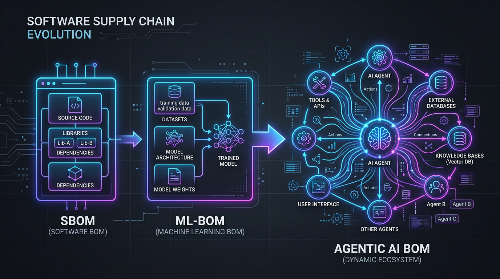
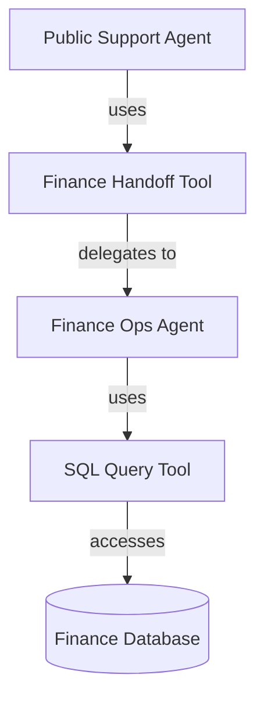
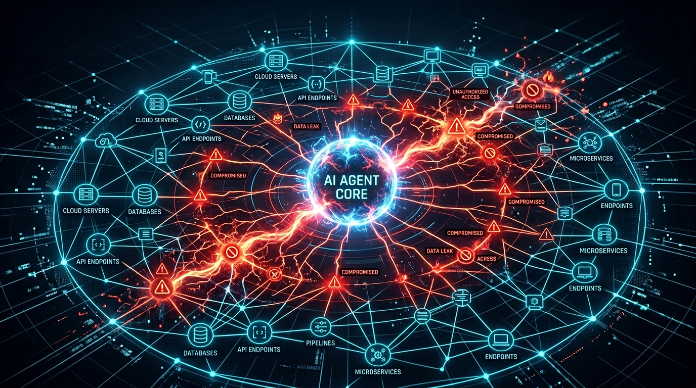

# Agentic AI BOM for Enterprises
## How to inventory agent tools, delegation paths, and blast radius

*Follow-up to [The AI Supply Chain Problem in 2026](/blog/ai-supply-chain-mlbom-2026). Build notes from the `agent-aibom` project: Claude Code manifests, MCP server configs, delegation graphs, static posture analysis, and developer-first governance.*

---

## Executive Summary

In the last article, I argued that the AI supply chain is broader than most organizations admit. It is not just models and datasets. It is also inference APIs, Model Context Protocol (MCP) server connections, tool bindings, and the growing chain of systems that AI agents can read from, write to, and trigger.

That argument still holds, but it needs a sharper operational distinction.

The rapid development of generative AI has outpaced existing software supply chain security (SSCS) frameworks. While organizations have matured their use of SBOMs and SCA tools, these remain blind to the core components of AI. An **ML-BOM** tells you what model artifact you are using and where it came from. An **Agentic AI BOM** tells you what that model can *do* inside your environment: which tools it can call, which systems those tools reach, whether it can delegate to other agents, and what the blast radius looks like if any one part of that chain is compromised.

That is the missing layer.



This is the reason I started building **`agent-aibom`**: a CLI-first open-source project for discovering agents, mapping their permissions and delegations into a graph, and scoring the security posture of the resulting system. The first milestone is deliberately narrow and practical: static discovery of Claude Code, MCP, and adjacent repository patterns before expanding into a broader runtime and standards story.

If the first article was about **why AI-BOMs matter**, this one is about **why agentic systems need a different shape of inventory altogether**.

> An ML-BOM tells you what model is present.  
> An Agentic AI BOM tells you what that model is allowed to do.

---

## The Problem Is No Longer Just Lineage. It Is Agency.

The AI-BOM conversation usually starts with training data, model lineage, weight access policy, and inference dependencies. That is the right place to start for compliance, legal review, and third-party risk management.

But once you give a model tools, memory, approvals, and the ability to invoke or delegate work, the risk model changes. We are accumulating massive **provenance debt**—building on foundation layers without verifying the security posture of the underlying weights, datasets, or the dynamic tools they assemble at runtime.

A customer support agent with read-only knowledge retrieval is one thing.

A customer support agent that can:

- call an MCP server
- hand off work to a finance agent
- execute SQL through an approved tool
- write back into an internal system
- browse the public web for context

is no longer just a model dependency. It is a software actor with reach. 

Agentic AI creates a dynamic and unpredictable supply chain. A single malicious tool descriptor or unverified API can trigger unauthorized system actions or propagate generative worms. Adversaries can manipulate an agent’s "stochastic" decision-making process by poisoning the data it perceives or the tools it invokes.

That means the core governance question shifts:

- not only "Which model are we using?"
- but "Which autonomous system can act, through what paths, with what inherited authority?"

That is what a static ML-BOM does not capture well.

---

## An Agentic AI BOM Is a Graph, Not a List

Traditional SBOMs and ML-BOMs are mostly lists with relationships attached. Agentic systems are more dynamic than that. The right abstraction is not a spreadsheet. It is a graph.

At minimum, two graph structures matter.

### 1. The Permission Graph

This answers:

- which agent uses which tool
- which tool reaches which external or internal system
- what scopes, approvals, or constraints sit on that edge

The shape looks like this:



A flat inventory would tell you that the finance agent has a SQL tool. A graph tells you that the public support agent may effectively have a path to the finance database through delegation. 

That is a materially different security conclusion.

### 2. The Delegation Graph

This answers:

- which agents can spawn or route to other agents
- whether permissions are inherited or merely invoked
- how deep a delegation chain can go
- what the transitive blast radius becomes when one agent is compromised

Delegation is the least documented and most easily underestimated part of the agent stack. Teams often reason about permissions one agent at a time. Attackers do not. They reason across the chain.

If Agent A can delegate to Agent B, and Agent B can trigger a privileged tool, then the question is not whether Agent A directly has that tool. The question is whether Agent A can reach it. 



This leads to **systemic operational contagion**. In agentic environments, a single unvetted dependency, such as a malicious MCP server or a compromised third-party tool, can serve as a beachhead for lateral movement. This allows attackers to bypass perimeter defenses, leading to unauthorized data exfiltration, the execution of fraudulent transactions, or the disruption of core business operations.

As AI agents gain the ability to execute actions rather than just generate text, failures carry severe real-world consequences—whether financial, reputational, or operational. Organizations cannot accept the error rates or hallucinations typical of isolated chatbots when the blast radius extends deep into enterprise infrastructure.

---

## Static Posture Has To Come Before Runtime Tracing

One of the first design decisions in `agent-aibom` was what *not* to do in v1.

The obvious temptation is to start with runtime instrumentation:

- intercept every LLM call
- capture every tool execution
- build a live ledger of decisions and actions
- reconstruct the agent chain after the fact

That work matters. It is also a second-order problem.

Before you can govern runtime behavior, you need a baseline of what the system is configured to do. In practice, most teams do not even have that baseline today. Standard application security testing still struggles to detect **sleeper backdoors** or poisoned model weights that are executed only on specific triggers.

That is why the first milestone is focused on **static posture**.

The initial scanners look at repository-native surfaces such as:

- `.claude/agents/*.md`
- `.mcp.json`
- MCP server code patterns such as `@mcp.tool()`
- generic framework and tool-binding patterns that signal agentic behavior

From those artifacts, you can already answer important governance questions before a single token is generated:

- Which agents have external action surfaces?
- Which agents lack an owner?
- Which privileged tools have no approval gate?
- Which internal agents are bound to unapproved model endpoints?
- Which delegation paths are unbounded?

Static posture is not the whole story, but it is the first story every enterprise needs.

---

## Why The First Release Is Deliberately Narrow

There is a strong urge in AI tooling to announce universal framework support on day one. That usually produces weak scanners, vague claims, and brittle demos.

The better strategy is to earn credibility on the surfaces enterprises are already shipping.

For `agent-aibom`, that means the first public milestone is centered on:

- **Claude Code**
- **MCP**
- **generic repository heuristics for adjacent agent patterns**

That scope is intentional.

Claude Code and MCP already expose exactly the kinds of governance gaps most teams are missing:

- agent definitions living in markdown and config
- tool exposure through local or remote MCP servers
- implicit permissions that are obvious in repository structure but invisible in standard security inventories
- multi-agent collaboration patterns that are easy to build and hard to audit

Broader framework coverage belongs in the next layer, not the first one. The architecture is designed to expand into CrewAI, LangGraph, and AutoGen, but credibility comes from being precise on the first surfaces, not from claiming coverage everywhere.

---

## Security Tooling Has To Live In The Developer Workflow

Most governance products fail for the same reason: they live in a dashboard nobody opens after the initial rollout.

Agent governance has to show up where developers actually make decisions:

- in the repository
- in the terminal
- in pull requests
- in CI/CD

That is why `agent-aibom` is being built CLI-first.

The workflow is straightforward:

```bash
agent-aibom scan .
agent-aibom risk .
agent-aibom graph .
agent-aibom export --format sarif
agent-aibom diff <previous-bom> <current-bom>
```

The purpose of each step is different:

- `scan` discovers the inventory
- `risk` scores the posture against built-in rules
- `graph` explains reachability and delegation visually
- `export` pushes findings into existing security workflows
- `diff` makes drift visible between one repository state and the next

This matters because agent governance is not a once-per-quarter review activity. It is configuration drift management for autonomous systems.

If a new tool gets added to an internal agent, or a delegation chain is widened in a pull request, that should be observable as a posture change, not discovered months later during audit.

---

## Provenance Matters As Much As The Finding

One lesson from security tooling generally applies here: people do not trust scanners that cannot explain themselves.

If a tool says "data exfiltration risk" but cannot show the specific path that triggered the judgment, engineers will ignore it. They should.

That is why a useful Agentic AI BOM has to preserve **provenance**:

- where the evidence came from
- whether it was static analysis, policy evaluation, or runtime data
- how confident the tool is in the conclusion
- which file, binding, or edge created the result

This is more important in agent systems than in standard app security because the interesting risks are relational. A finding is often not tied to one object. It is tied to a chain:

- agent definition
- tool exposure
- system reachability
- delegation edge
- missing approval boundary

If you cannot explain the chain, you cannot remediate it.

---

## The Output Format Also Has To Meet Teams Where They Are

There is no value in creating a new governance artifact that cannot plug into existing operating models.

That is why the early export targets matter:

- **JSON** for native BOM persistence and machine processing
- **SARIF** for developer and security integrations
- **CSV** for audit and spreadsheet-driven review
- **Mermaid** for architecture diagrams in pull requests and docs

The long-term standards story is still important. CycloneDX and SPDX will matter for enterprise portability and procurement workflows.

But standards mapping should come after the structure is correct. If the graph semantics are wrong, exporting them into a standard does not make them useful. It only makes them standardized and wrong.

The correct sequence is:

1. discover the real surfaces
2. model the real relationships
3. score the real risk
4. then standardize the output

That is the path `agent-aibom` is following.

---

## What Enterprises Should Do Now

You do not need to wait for a perfect platform to start governing agents.

The practical first moves are simpler than most organizations think:

### 1. Inventory Tool-Bound Agents

Start with every agent that can do more than answer questions. If it can call tools, browse, write, execute, or delegate, it belongs in scope.

### 2. Draw The Delegation Paths

Do not stop at direct permissions. Identify which agents can route work to which other agents and what those downstream agents can reach.

### 3. Separate Discovery From Enforcement

Your first goal is visibility. Your second goal is policy. Most teams try to jump straight to runtime guardrails without ever establishing a baseline map.

### 4. Treat Agent Config As Security-Relevant Code

Agent manifests, tool bindings, MCP configuration, approval gates, and model endpoints should be reviewed with the same seriousness as IAM or infrastructure configuration.

### 5. Make Drift Visible

The useful question is not only "What do we have?" but "What changed?" Agent posture needs historical comparison, not just snapshots.

---

## The Road Ahead

The first `agent-aibom` milestone is intentionally focused on static repository discovery, graph construction, and risk scoring for the most immediate Claude Code and MCP use cases.

The next layers are already clear:

- broader framework coverage across CrewAI, LangGraph, and AutoGen
- richer standards export through CycloneDX and SPDX profiles
- graph persistence and enterprise querying
- runtime trace enrichment and execution ledgers
- API and dashboard layers for larger operating models

But the foundational principle will not change:

**you cannot secure what you have not mapped, and you cannot map agents correctly if you treat them as flat dependencies.**

The industry needed the ML-BOM conversation. It forced teams to think about provenance, lineage, datasets, and model supply chains.

The next step is just as important.

We now need an inventory that describes not only what AI systems are made of, but what they are empowered to do.

That is the difference between documenting a model and governing an autonomous system.

---

## Related Reading

- [The AI Supply Chain Problem in 2026](/blog/ai-supply-chain-mlbom-2026)
- [Governing Agentic AI in 2026 — Deep Research Edition](/blog/governing-agentic-ai-2026)

*Draft note: add the live `agent-aibom` repository link before publishing if the project is public at release time.*
